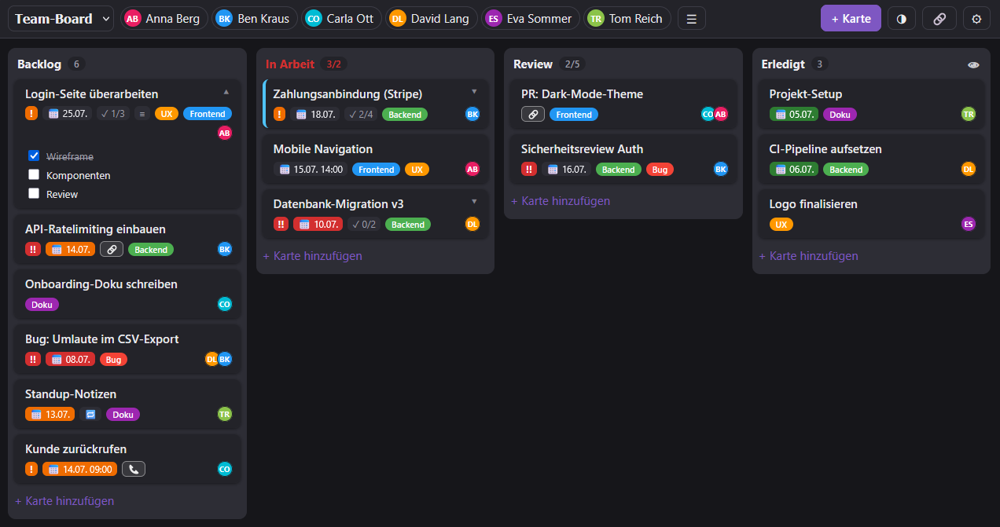
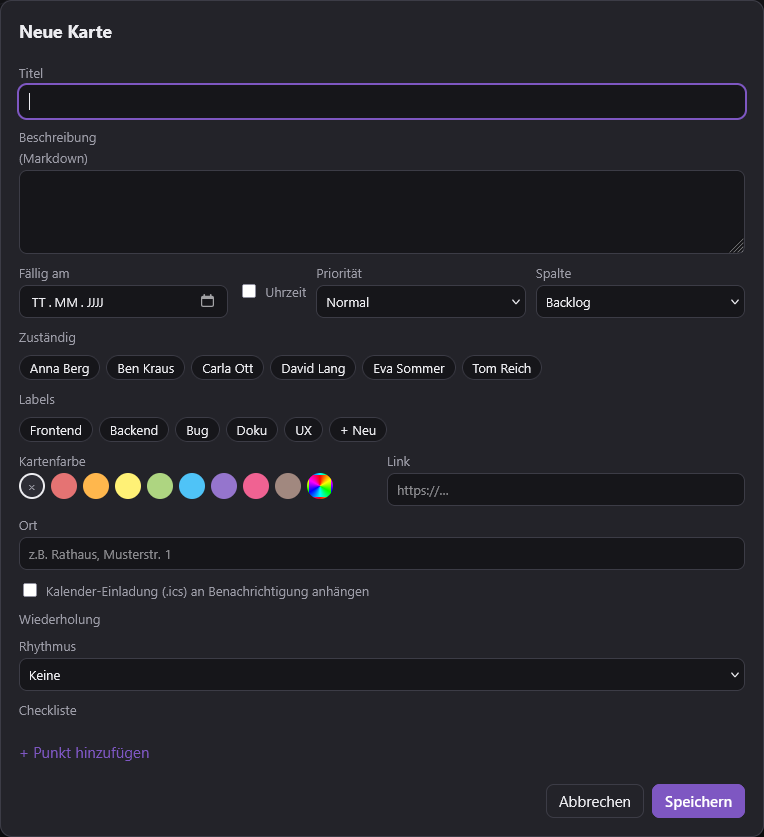
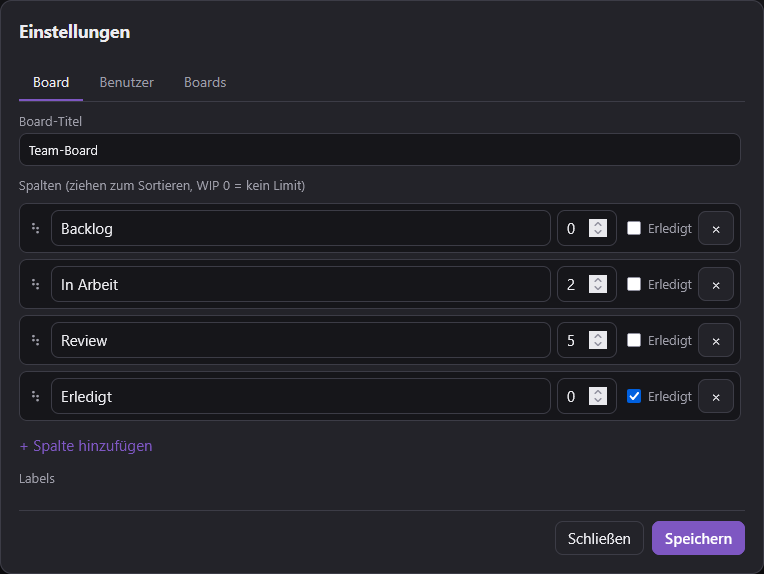
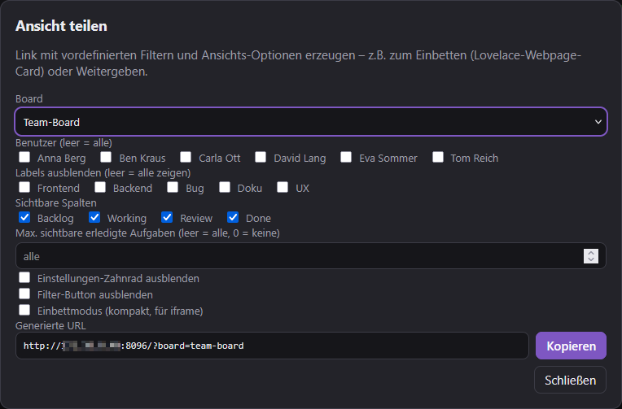

# ioBroker Kanban – Dokumentation (Deutsch)

Ein vollwertiges **Kanban-Board als eigener ioBroker-Adapter**. Der Adapter bringt einen eigenen Webserver mit, serviert eine schlanke Single-Page-App (Vanilla-JS, ohne Framework) und hält alle Ansichten per WebSocket live synchron. Karten lassen sich per Drag & Drop verschieben, Boards und Spalten frei konfigurieren, Aufgaben wiederkehrend planen, Benachrichtigungen per E-Mail verschicken (inkl. Kalender-Einladung) und das Ganze per REST/Webhook/`sendTo` in andere Automatisierungen einbinden.

> **Für wen?** Für alle, die im Smart-Home eine gemeinsame Aufgabenverwaltung wollen – Familie, WG, Haustechnik-Wartung – und diese eng mit ioBroker (Skripte, Lovelace, Node-RED) verzahnen möchten.

> **Version 0.1.2** – „Ansicht teilen": Labels wirken jetzt als **Blacklist** (Auswahl blendet aus, neue Labels bleiben sichtbar); `doneLimit` unterscheidet **leer = alle** und **`0` = keine**.

> **Version 0.1.1** – Sicherheits-Update: Schreibschutz der REST-API per Token (`X-Kanban-Token`), vor XSS bereinigte Markdown-Vorschau, nur sichere Link-Schemata und eine Content-Security-Policy. Details unter [Sicherheit & Zugriffsschutz](#sicherheit--zugriffsschutz).



---

## Inhalt

- [Installation & erste Schritte](#installation--erste-schritte)
- [Benutzer](#benutzer)
- [Karten – alle Felder](#karten--alle-felder)
- [Wiederholungen](#wiederholungen)
- [Feiertage](#feiertage)
- [Spalten & WIP-Limit](#spalten--wip-limit)
- [Ansichten teilen / URL-Parameter](#ansichten-teilen--url-parameter)
- [Benachrichtigungen](#benachrichtigungen)
- [Webhooks – eingehend](#webhooks--eingehend)
- [Webhooks – ausgehend](#webhooks--ausgehend)
- [REST-API](#rest-api)
- [Sicherheit & Zugriffsschutz](#sicherheit--zugriffsschutz)
- [Weitere Integrationswege (sendTo, action-State)](#weitere-integrationswege)
- [Live-Sync & Deep-Links](#live-sync--deep-links)
- [ioBroker-States & Objekte](#iobroker-states--objekte)
- [Sprache / Mehrsprachigkeit](#sprache--mehrsprachigkeit)
- [FAQ & Fallstricke](#faq--fallstricke)

---

## Installation & erste Schritte

1. Adapter installieren und eine **Instanz** anlegen (`kanban.0`).
2. In den Instanzeinstellungen ggf. **Port** (Standard `8095`), **IP-Bindung** (Standard `0.0.0.0`) und **Basis-URL** anpassen.
3. Web-UI öffnen: **`http://<host>:8095/`**
4. Beim ersten Start ist noch kein Board vorhanden. Über das **Zahnrad-Symbol (⚙)** oben rechts ein neues Board anlegen. Jedes neue Board erhält automatisch drei Standardspalten:
   - **Zu erledigen** (`todo`)
   - **In Arbeit** (`doing`)
   - **Erledigt** (`done`, als „Erledigt"-Spalte markiert)
5. Mit **„+ Karte"** die erste Aufgabe anlegen.

### Allgemeine Einstellungen (Tab „Allgemein")

| Einstellung | Bedeutung |
|---|---|
| **Port** | Port des Webservers (Standard `8095`). Ist er belegt, wählt der Adapter automatisch einen freien Port. |
| **IP-Adresse** | Bind-Adresse (Standard `0.0.0.0` = alle Interfaces). |
| **Basis-URL** | Öffentlich erreichbare URL, die in E-Mail-Links verwendet wird (z. B. hinter einem Reverse-Proxy). Leer = automatische Ermittlung der lokalen IP. |
| **Standard-Theme** | `auto` (System), `light` oder `dark`. |
| **Akzentfarbe** | Farbe der Bedienelemente (Standard `#7E57C2`). |
| **Eigenes CSS** | Wird als `/api/custom.css` eingebunden – für individuelle Anpassungen. |

---

## Benutzer

Benutzer werden in den Instanzeinstellungen (Tab **„Benutzer"**) als Tabelle gepflegt. Sie erscheinen als Chips in der Kopfzeile und lassen sich Karten als Zuständige zuweisen.

| Feld | Bedeutung |
|---|---|
| **name** | Interne ID, klein geschrieben, ohne Umlaute (z. B. `bjoern`). Wird in URL-Parametern und Zuweisungen verwendet. |
| **displayName** | Anzeigename (z. B. `Björn`). |
| **email** | Optional. Zieladresse für E-Mail-Benachrichtigungen. |
| **color** | Farbe des Avatars/Chips (Standard, solange kein Avatar-Bild hinterlegt ist). |
| **notify…** | Sechs Checkboxen je Benutzer für die Benachrichtigungssteuerung – siehe [Benachrichtigungen](#benachrichtigungen). |

**Avatar-Bild (optional):** Standardmäßig zeigt der Avatar die Initialen (auf der Benutzerfarbe). In der Board-Oberfläche unter **⚙ → „Benutzer-Avatare"** kann man je Benutzer ein **PNG/JPG hochladen**, das dann rund als Avatar erscheint (mit Vorschau; das Bild wird automatisch quadratisch zugeschnitten, auf 128 px verkleinert und im ioBroker-Dateispeicher abgelegt – kein Config-Ballast). „Avatar entfernen" schaltet zurück auf die Initialen.

---

## Karten – alle Felder

Ein **Klick auf eine Karte** öffnet den Editor. Eine Karte hat folgende inhaltliche Felder (per API unter denselben Namen setzbar):



| Feld | Typ | Beschreibung |
|---|---|---|
| **title** | Text | Titel der Aufgabe (Pflichtfeld). |
| **description** | Markdown | Beschreibung; wird als Markdown gerendert (Links, Bilder, Listen …). Eingebettetes HTML wird vor der Anzeige bereinigt (XSS-Schutz). |
| **due** | `YYYY-MM-DD` | Fälligkeitsdatum. Überfällige/bald fällige Karten werden farblich hervorgehoben. |
| **dueTime** | `HH:MM` | Optionale Uhrzeit. Wird über eine Checkbox aktiviert und erscheint auf der Karte hinter dem Datum. Nur wirksam zusammen mit `due`. |
| **priority** | `0`/`1`/`2` | Normal / Hoch / Dringend. |
| **assignees** | Liste von Benutzer-IDs | Zuständige. Steuern, wer Benachrichtigungen erhält. |
| **labels** | Liste von Label-IDs | Farbige Schlagworte. Labels werden pro Board verwaltet (anlegen, umbenennen, umfärben, löschen). |
| **color** | Hex-Farbe | Farbiger Balken links an der Karte. Wähbar über einen eingebetteten Colorpicker (Farbfeld + Farbton-Regler + Hex-Eingabe) oder Presets. |
| **link** | URL | Verknüpfung. Auf der Karte erscheint ein **typabhängiges Icon**: ✉️ `mailto:`, 📞 `tel:`, ▶️ YouTube, 📄 PDF, 🖼️ Bild, 🚗 Route/Navigation (Waze, Google-Maps-Route), 📍 Ort (Maps/Apple/OSM/`geo:`), 🏠 interne IP (172.30./192.168./10./localhost), 🔗 sonst. |
| **location** | Text | Ort. Erscheint als 📍-Badge auf der Karte und wird als `LOCATION` in die Kalender-Einladung übernommen. |
| **checklist** | Liste | Unterpunkte mit Häkchen; auf der Karte als Fortschritt `✓ 2/5`. Über den **Chevron (▾/▴)** oben rechts lassen sich die Punkte direkt auf der Karte auf-/zuklappen und **abhaken** (wird sofort gespeichert). |
| **calendarInvite** | Ja/Nein | Wenn aktiviert **und** ein Fälligkeitsdatum gesetzt ist, wird jeder Benachrichtigungs-E-Mail zu dieser Karte eine **`.ics`-Kalender-Einladung** angehängt. |
| **recurrence** | Objekt | Wiederholungsregel – siehe [Wiederholungen](#wiederholungen). |

Zusätzlich verwaltet der Adapter automatisch: `id`, `columnId`, `order`, `createdAt`, `createdBy`, `movedAt`, `doneAt`.

---

## Wiederholungen

Wiederkehrende Aufgaben funktionieren **beim Erledigen** (Kanban-typisch): Sobald eine wiederkehrende Karte in die „Erledigt"-Spalte wandert, wird automatisch eine **frische Karte** mit dem nächsten passenden Fälligkeitsdatum in der ersten Nicht-Erledigt-Spalte angelegt (Checklisten-Haken zurückgesetzt). Karten mit Wiederholung tragen ein 🔁-Badge.

Wird eine wiederkehrende Karte **ohne** manuelles Datum angelegt, setzt der Adapter automatisch das nächste passende Datum.

| Typ (`recurrence.type`) | Bedeutung | Zusätzliche Felder |
|---|---|---|
| `daily` | Täglich | – |
| `weekly` | An bestimmten Wochentagen | `dayOfWeek`: Liste `[1..7]` (1 = Montag … 7 = Sonntag) |
| `monthly` | Fester Tag im Monat | `dayOfMonth`: `1..31` (der 31. wird in kurzen Monaten auf den letzten Tag begrenzt) |
| `monthly_weekday` | N-ter/letzter Wochentag im Monat, z. B. **2. Dienstag** | `ordinal`: `1..4` oder `-1` (letzter), `dayOfWeek`: `[iso]` |
| `workday` | Erster/letzter/n-ter **Arbeitstag** im Monat | `workdayPos`: `first` / `last` / `nth` / `nth_last`, `n`: bei `nth`/`nth_last` |
| `yearly` | Jährlich | `month`: `1..12`, `dayOfMonth`: `1..31` |
| `every_n_days` | Alle X Tage ab Startdatum | `interval`: N, `startDate`: `YYYY-MM-DD` |

**Arbeitstag** heißt: kein Wochenende **und** kein gesetzlicher Feiertag (siehe unten). Beispiel: „erster Arbeitstag im Mai" landet auf dem 4.5., wenn der 1.5. auf einen Feiertag/Wochenende fällt.

---

## Feiertage

Für die **Arbeitstag-Wiederholungen** ermittelt der Adapter die gesetzlichen Feiertage selbst (Osterformel + feste Tage + Buß- und Bettag), damit auch weit in der Zukunft liegende Termine korrekt berechnet werden.

- Ist der ioBroker-Adapter **`feiertage`** installiert, übernimmt der Kanban-Adapter dessen **Bundesland-Konfiguration** (welche Feiertage gelten). Es zählen nur die tatsächlich gesetzlich arbeitsfreien Tage – reine Dekotage (z. B. Valentinstag) werden ignoriert.
- Ohne `feiertage`-Adapter greift ein **Fallback** mit den bundesweit einheitlichen gesetzlichen Feiertagen.

> Änderungen am `feiertage`-Adapter werden beim nächsten Start von `kanban.0` übernommen.

---

## Spalten & WIP-Limit

Spalten werden pro Board über das **Zahnrad (⚙)** verwaltet: anlegen, per Drag & Drop sortieren, umbenennen, löschen.



- **WIP-Limit** (Work-in-Progress): Zahl > 0 begrenzt die empfohlene Kartenanzahl. Wird sie überschritten, warnt die Spalte optisch (Zähler & Kopf werden hervorgehoben). `0` = kein Limit. Das Limit ist eine **Warnung**, keine harte Sperre.
- **„Erledigt"-Spalte** (`isDone`): Karten, die hierher verschoben werden, gelten als erledigt (`doneAt` wird gesetzt, Wiederholungen werden ausgelöst).
- **Erledigt ein-/ausblenden (👁):** Jede Erledigt-Spalte hat oben rechts einen Augen-Umschalter, der die erledigten Karten ein- oder ausblendet (pro Gerät gespeichert).
- **Limit sichtbarer erledigter Karten:** Per URL-Parameter `doneLimit=N` (siehe unten) lassen sich nur die N zuletzt erledigten Karten anzeigen – praktisch für kompakte, geteilte Ansichten.

---

## Ansichten teilen / URL-Parameter

Über das **🔗-Symbol** in der Kopfzeile öffnet sich der Dialog **„Ansicht teilen"**. Dort klickst du dir eine gefilterte Ansicht zusammen (Board, Benutzer (mehrfach), Labels (mehrfach), sichtbare Spalten, Limit für erledigte Karten, auszublendende Bedienelemente) und erhältst darunter eine **fertige URL zum Kopieren**. Ideal zum Einbetten in Lovelace (Webpage-Card) oder zum Weitergeben.



Alle Parameter lassen sich auch direkt an die URL hängen:

| Parameter | Wirkung |
|---|---|
| `board=<id>` | Öffnet dieses Board. |
| `user=<name>` | Setzt den aktiven Benutzer (Chip-Hervorhebung, „nur meine Karten"). |
| `filter=1` | Aktiviert den Personenfilter für den aktiven Benutzer. |
| `users=<name,name>` | **Mehrfach-Benutzerfilter**: zeigt Karten, die mindestens einem dieser Benutzer zugewiesen sind. |
| `label=<id,id>` | **Label-Blacklist** (mehrere möglich): blendet Karten mit einem dieser Labels aus – neue Labels bleiben automatisch sichtbar. |
| `columns=<id,id>` | Zeigt nur diese Spalten. Nicht genannte Spalten werden ausgeblendet. |
| `doneLimit=N` | In Erledigt-Spalten nur die N zuletzt erledigten Karten anzeigen (`0` = keine, weglassen = alle). |
| `hideSettings=1` | Blendet das Einstellungen-Zahnrad aus. |
| `hideFilter=1` | Blendet den Filter-Button aus. |
| `embed=1` | **Einbettmodus**: blendet die komplette Kopfleiste aus (für iframe/Lovelace). |
| `theme=auto\|light\|dark` | Erzwingt ein Theme. |
| `accent=%23RRGGBB` | Akzentfarbe (Hex, `#` als `%23` kodieren). |
| `card=<id>` | Öffnet direkt eine Karte (Deep-Link, z. B. aus E-Mails). |

**Beispiele**

```
# Kompakte Einbettung: nur Board "familie", ohne Kopfleiste
http://192.168.1.10:8095/?board=familie&embed=1&theme=auto

# Nur "In Arbeit"-Spalte + letzte 3 erledigte, gefiltert auf zwei Personen
http://192.168.1.10:8095/?board=familie&columns=doing,done&doneLimit=3&users=bjoern,heike

# Alles außer Karten mit Label "privat", Einstellungen ausgeblendet
http://192.168.1.10:8095/?board=familie&label=privat&hideSettings=1
```

> **Lovelace/iframe:** Der Adapter setzt **keine** Frame-Header (`X-Frame-Options`/`frame-ancestors`). Die ab 0.1.1 gesetzte CSP steht als `<meta>` und schränkt die Einbettung **nicht** ein – die UI lässt sich also weiterhin direkt in eine Lovelace-Webpage-Card oder ein `<iframe>` einbetten.

---

## Benachrichtigungen

Benachrichtigungen werden bei Karten-Ereignissen ausgelöst und per **E-Mail** (über den ioBroker-`email`-Adapter) und/oder **ausgehende Webhooks** verteilt. Zusätzlich wird jedes Ereignis in den State `kanban.0.lastEvent` geschrieben (als Skript-Trigger).

### Steuerung pro Benutzer

In der Benutzer-Tabelle gibt es je Benutzer sechs Checkboxen – bei welchen Ereignissen er eine E-Mail erhalten soll:

| Ereignis | Auslöser |
|---|---|
| **Karte zugewiesen** (`notifyAssigned`) | Karte wurde diesem Benutzer zugewiesen. |
| **Karte fällig** (`notifyDue`) | Fälligkeit erreicht/überschritten (siehe Erinnerungszeit). |
| **Karte geändert** (`notifyUpdated`) | Eine Karte wurde bearbeitet. |
| **Karte verschoben** (`notifyMoved`) | Karte in andere Spalte verschoben. |
| **Karte erledigt** (`notifyDone`) | Karte in die Erledigt-Spalte verschoben. |
| **Karte erstellt** (`notifyCreated`) | Neue Karte angelegt. |

**Fallback:** Hat ein Benutzer bei einem Ereignis nichts eingestellt, greift die **globale Vorgabe** (Tab „E-Mail", Abschnitt „Standard-Vorgabe"). So bekommen bestehende Benutzer weiterhin Benachrichtigungen, ohne dass für jeden alles einzeln gesetzt werden muss.

**Kein Selbst-Spam:** Wer eine Änderung auslöst, wird über genau diese Änderung nicht selbst benachrichtigt.

**Empfänger:** Bei Zuweisung nur der neu Zugewiesene, sonst alle Zuständigen der Karte (die eine E-Mail-Adresse hinterlegt haben).

### E-Mail & Erinnerungen (Tab „E-Mail")

| Einstellung | Bedeutung |
|---|---|
| **email-Adapter-Instanz** | Welche `email.x`-Instanz für den Versand genutzt wird. |
| **Absender** | Optionale Absenderadresse (leer = Standard des email-Adapters). |
| **Erinnerungs-Uhrzeit** | `HH:MM` – wann fällige Karten geprüft werden (Standard `08:00`). |
| **Erinnern X Tage vor Fälligkeit** | Vorlauf für `cardDue`-Erinnerungen. |
| **Standard-Vorgabe** | Globale Fallback-Schalter je Ereignis (siehe oben). |

### Kalender-Einladung (.ics)

Ist an einer Karte **„Kalender-Einladung"** aktiviert und ein Datum gesetzt, hängt der Adapter der Benachrichtigungs-E-Mail eine `termin.ics` an:

- **Ohne Uhrzeit** → Ganztagestermin am Fälligkeitstag.
- **Mit Uhrzeit** → Termin mit Start und einer Stunde Dauer.
- Übernommen werden Titel (`SUMMARY`), Beschreibung, **Ort** (`LOCATION`) und Link (`URL`).
- **Zeitzone:** Uhrzeit-Termine werden eindeutig in UTC ausgegeben; die zugrunde liegende Zeitzone wird aus dem System ermittelt (bzw. `system.config`) – Sommer-/Winterzeit inklusive. Ganztägige Termine sind bewusst zeitzonenlos.

Der Anhang wird bei **jeder** Benachrichtigung zur Karte mitgeschickt – aktivierst du die Einladung z. B. erst nachträglich, kommt sie mit der nächsten „Karte geändert"-Mail.

---

## Webhooks – eingehend

Andere Systeme (oder ioBroker selbst) können Karten/Boards per HTTP verändern. Eingehende Webhooks sind über **Tokens** abgesichert (Tab **„Webhooks (eingehend)"**).

### Token-Verwaltung

| Feld | Bedeutung |
|---|---|
| **name** | Bezeichnung (erscheint in Logs als Quelle). |
| **token** | Geheimes Token, Teil der URL. |
| **allowedBoards** | `*` = alle Boards, oder eine Liste erlaubter Board-IDs (durch Leerzeichen/Komma getrennt). |
| **enabled** | Token aktiv/inaktiv. |

Mit dem Button **„Neuen Token generieren"** (über der Tabelle) wird automatisch eine neue Zeile mit einem sicheren Zufallstoken (32 Hex-Zeichen) und dem Namen `agent`/`agent1`/… angelegt. Danach den Namen anpassen, ggf. `allowedBoards` einschränken und **Speichern**. Alternativ das Token-Feld von Hand ausfüllen (z. B. `openssl rand -hex 16`). **Empfehlung:** für jede Integration (jeder Agent, jedes Skript) einen eigenen Token – so lässt sich jeder einzeln per `enabled`-Häkchen sperren oder ersetzen.

Ungültiges Token → HTTP `401`. Board nicht erlaubt → HTTP `403`.

### Generischer Endpunkt (empfohlen)

```
POST /webhook/<token>/action
Content-Type: application/json
```

Der Body enthält `cmd` plus die passenden Felder. Es gilt dasselbe **Kommando-Vokabular** wie bei `sendTo` und dem `action`-State:

| `cmd` | Pflichtfelder | Weitere Felder |
|---|---|---|
| `addBoard` | `title` | `id` (optional, sonst aus Titel erzeugt) |
| `deleteBoard` | `board` | – |
| `addCard` | `board`, `title` | alle Kartenfelder (`due`, `assignees`, `labels`, `priority`, `location`, `recurrence`, …), `columnId` |
| `updateCard` (Alias `editCard`) | `board`, `cardId`\|`id` | zu ändernde Kartenfelder |
| `moveCard` | `board`, `cardId`\|`id`, `column`\|`columnId` | `order` |
| `doneCard` | `board`, `cardId`\|`id` | – (verschiebt in die Erledigt-Spalte) |
| `deleteCard` | `board`, `cardId`\|`id` | – |
| `listBoards` / `getBoards` | – | – |
| `getBoard` | `board` | – |

> **Feldnamen-Fallstricke (wichtig!)**
> - Die Karten-ID heißt **`cardId` ODER `id`** – **nicht** `card`.
> - Die Zielspalte bei `moveCard` heißt **`column` ODER `columnId`**.
> - Das Board wird über **`board` ODER `boardId`** angegeben.

**Beispiele**

```bash
TOKEN=dein_token
BASE=http://192.168.1.10:8095

# Karte anlegen
curl -X POST "$BASE/webhook/$TOKEN/action" -H 'Content-Type: application/json' -d '{
  "cmd": "addCard",
  "board": "familie",
  "columnId": "todo",
  "title": "Mülltonne rausstellen",
  "due": "2026-07-20",
  "assignees": ["bjoern"],
  "labels": ["haushalt"],
  "priority": 1
}'

# Karte in eine andere Spalte verschieben
curl -X POST "$BASE/webhook/$TOKEN/action" -H 'Content-Type: application/json' -d '{
  "cmd": "moveCard", "board": "familie", "cardId": "c_abc123", "column": "doing"
}'

# Karte als erledigt markieren
curl -X POST "$BASE/webhook/$TOKEN/action" -H 'Content-Type: application/json' -d '{
  "cmd": "doneCard", "board": "familie", "id": "c_abc123"
}'

# Karte ändern (z. B. Kalender-Einladung nachträglich aktivieren)
curl -X POST "$BASE/webhook/$TOKEN/action" -H 'Content-Type: application/json' -d '{
  "cmd": "updateCard", "board": "familie", "id": "c_abc123",
  "calendarInvite": true, "location": "Rathaus Musterstadt"
}'

# Karte löschen
curl -X POST "$BASE/webhook/$TOKEN/action" -H 'Content-Type: application/json' -d '{
  "cmd": "deleteCard", "board": "familie", "id": "c_abc123"
}'
```

### Ressourcen-Endpunkte (Alternative)

Dieselben Aktionen gibt es auch als REST-artige Webhook-Routen (Token in der URL):

```
POST   /webhook/<token>/boards/<id>/cards
PATCH  /webhook/<token>/boards/<id>/cards/<cardId>
POST   /webhook/<token>/boards/<id>/cards/<cardId>
POST   /webhook/<token>/boards/<id>/cards/<cardId>/move
```

---

## Webhooks – ausgehend

Der Adapter kann bei jedem Ereignis einen **HTTP-POST** an beliebige URLs senden (Tab **„Webhooks (ausgehend)"**) – z. B. an Node-RED, IFTTT, einen Chat-Dienst oder eigene Skripte.

| Feld | Bedeutung |
|---|---|
| **name** | Bezeichnung. |
| **url** | Ziel-URL (empfängt `POST` mit JSON-Body). |
| **events** | `*` = alle Ereignisse, oder eine Liste von Ereignistypen (durch Komma/Semikolon/Leerzeichen getrennt). |
| **enabled** | Aktiv/inaktiv. |

**Ereignistypen:** `cardCreated`, `cardUpdated`, `cardMoved`, `cardAssigned`, `cardDone`, `cardDeleted`, `cardDue`.

**Zustellung:** HTTP-POST mit `Content-Type: application/json`, 5 Sekunden Timeout, **ein** automatischer Wiederholungsversuch nach 2 Sekunden.

**Beispiel-Payload** (Body des ausgehenden POST):

```json
{
  "event": "cardMoved",
  "ts": "2026-07-12T14:05:46.415Z",
  "board": { "id": "familie", "title": "Familie" },
  "card": {
    "id": "c_abc123",
    "title": "Mülltonne rausstellen",
    "columnId": "doing",
    "due": "2026-07-20",
    "assignees": ["bjoern"],
    "labels": ["haushalt"],
    "priority": 1
  },
  "detail": { "fromColumn": "todo", "toColumn": "doing", "by": "bjoern" }
}
```

Jedes Event hat die Struktur `{ event, ts, board:{id,title}, card:{…}, detail:{…} }`. Das Feld `detail` variiert je Ereignistyp (z. B. `assignee` bei `cardAssigned`, `fromColumn`/`toColumn` bei `cardMoved`).

---

## REST-API

Für Integrationen im gleichen Netz steht eine REST-API bereit (dieselbe, die die Web-UI nutzt). **Lesen** (`GET`) ist offen, **Schreiben** (`POST`/`PATCH`/`DELETE`) erfordert ab 0.1.1 einen Token – siehe [Sicherheit & Zugriffsschutz](#sicherheit--zugriffsschutz).

| Methode & Pfad | Zweck |
|---|---|
| `GET /api/config` | UI-Konfiguration (Benutzer, Theme, Akzentfarbe). |
| `GET /api/users` | Benutzerliste. |
| `GET /api/custom.css` | Das in den Einstellungen hinterlegte eigene CSS. |
| `GET /avatars/<name>` | Avatar-Bild eines Benutzers (PNG). |
| `POST /api/users/<name>/avatar` | Avatar setzen (`{ image: "data:image/png;base64,…" }`, max. 512 KB; Token nötig). |
| `DELETE /api/users/<name>/avatar` | Avatar entfernen (Token nötig). |
| `GET /api/boards` | Alle Boards (Kurzform). |
| `POST /api/boards` | Board anlegen (`{ id?, title }`). |
| `GET /api/boards/<id>` | Board mit allen Karten. Mit `?rev=<n>` liefert es `{unchanged:true}`, falls unverändert (Polling). |
| `PATCH /api/boards/<id>` | Board ändern (Titel, Spalten, Labels). |
| `DELETE /api/boards/<id>` | Board löschen. |
| `POST /api/boards/<id>/cards` | Karte anlegen. |
| `PATCH /api/boards/<id>/cards/<cardId>` | Karte ändern. |
| `POST /api/boards/<id>/cards/<cardId>/move` | Karte verschieben (`{ columnId, order }`). |
| `DELETE /api/boards/<id>/cards/<cardId>` | Karte löschen. |

> **Schreibzugriffe** auf `/api` brauchen ab 0.1.1 einen Token (`X-Kanban-Token`; die Web-UI schickt ihn automatisch mit), **Lesen** bleibt im LAN offen. Details und Grenzen: [Sicherheit & Zugriffsschutz](#sicherheit--zugriffsschutz). Für Zugriffe von außen die tokenbasierten [Webhooks](#webhooks--eingehend) verwenden.

---

## Sicherheit & Zugriffsschutz

> **Neu in 0.1.1** – ergänzt nach einem Sicherheits-Review.

**Schreibschutz der REST-API (Token).** Lesende Zugriffe (`GET`) auf `/api` bleiben im LAN offen (Web-UI und einfache Dashboards brauchen keinen Token). **Schreibende** Zugriffe (`POST`/`PATCH`/`DELETE`) verlangen einen Token im Header `X-Kanban-Token`. Gültig sind:

- das automatisch erzeugte **SPA-Secret** (State `kanban.0.info.apiSecret`), das der Server der eigenen Oberfläche als `<meta name="kanban-token">` mitgibt – die Web-UI schickt es transparent mit, du musst nichts einstellen;
- jeder aktive **inboundToken** (Tab „Webhooks (eingehend)"), damit auch Skripte/Agenten `/api` schreibend nutzen können.

Ohne gültigen Token → HTTP `401`. Über die native Einstellung `apiWriteProtection: false` lässt sich der Schutz abschalten (dann verhält sich `/api` wie in 0.1.0).

> **Grenze dieses Schutzes (ehrlich):** Da die Oberfläche **ohne Login** arbeitet, kann ein Gerät im selben Netz, das die Seite lädt, das SPA-Secret mitlesen. Der Token wehrt damit zuverlässig **fremde Webseiten/CSRF** und naive Scanner ab, ist aber **kein** Ersatz für Netzisolation. Für harte Abschottung den Port nur ans LAN/`127.0.0.1` binden und einen Reverse-Proxy mit Authentifizierung davorsetzen.

**Sichere Beschreibungs-Vorschau.** Die Markdown-Beschreibung wird vor der Anzeige mit einem HTML-Sanitizer (DOMPurify) bereinigt – eingebettetes `<script>`, `onerror` u. Ä. wird entfernt (Schutz vor gespeichertem XSS).

**Nur sichere Link-Schemata.** Das Link-Badge einer Karte ist nur bei `http(s)`, `mailto:`, `tel:` und `geo:` anklickbar; andere Schemata (z. B. `javascript:`) werden nicht als Link ausgeführt.

**Content-Security-Policy.** Die Oberfläche setzt eine CSP (als `<meta>`), die Fremd-/Inline-Skripte unterbindet. Sie enthält **bewusst kein** `frame-ancestors`, damit die iframe-/Lovelace-Einbettung frei bleibt.

---

## Weitere Integrationswege

Dasselbe Kommando-Vokabular (`addCard`, `moveCard`, …) ist auf mehreren Wegen erreichbar:

**`sendTo` (aus ioBroker-Skripten):**

```javascript
sendTo('kanban.0', 'addCard', {
    board: 'familie',
    title: 'Aus dem Skript erstellt',
    due: '2026-07-20',
    assignees: ['bjoern']
}, (res) => log(JSON.stringify(res)));
```

**`action`-State:** Ein JSON-Kommando in den State `kanban.0.action` schreiben (ohne `ack`):

```javascript
setState('kanban.0.action', JSON.stringify({
    cmd: 'moveCard', board: 'familie', cardId: 'c_abc123', column: 'done'
}));
```

Der Adapter führt das Kommando aus und leert den State wieder.

---

## Live-Sync & Deep-Links

- **WebSocket `/ws`:** Bei jeder Änderung sendet der Server eine `dirty`-Nachricht an alle offenen Ansichten; diese laden das betroffene Board neu. So sehen alle Geräte Änderungen praktisch sofort.
- **Polling-Fallback:** Ist der WebSocket nicht verfügbar, fragt die UI periodisch mit `?rev=` nach Änderungen.
- **Deep-Link:** `…/?board=<id>&card=<id>` öffnet direkt die betreffende Karte – so verlinken auch die Benachrichtigungs-E-Mails („Karte im Board öffnen").

---

## ioBroker-States & Objekte

Neben der Oberfläche legt der Adapter States an, die sich in Skripten, VIS/Lovelace oder Node-RED auswerten lassen:

| State | Typ | Bedeutung |
|---|---|---|
| `kanban.0.info.connection` | bool | Webserver läuft. |
| `kanban.0.lastEvent` | json | Zuletzt ausgelöstes Ereignis (`{event, ts, board, card, detail}`) – ideal als Skript-Trigger. |
| `kanban.0.action` | json (beschreibbar) | Kommando-Eingang, siehe [Weitere Integrationswege](#weitere-integrationswege). |
| `kanban.0.info.apiSecret` | string | Interner Schreib-Token der REST-API (ab 0.1.1). |
| `kanban.0.boards.<id>.data` | json | Vollständiges Board (Karten, Spalten, Labels). |
| `kanban.0.boards.<id>.rev` | number | Revision (steigt bei jeder Änderung – für Polling). |
| `kanban.0.boards.<id>.cardCount` | number | Anzahl Karten im Board. |
| `kanban.0.boards.<id>.overdueCount` | number | Überfällige Karten im Board. |
| `kanban.0.users.<name>.assignedCount` | number | Offene, dieser Person zugewiesene Karten. |
| `kanban.0.users.<name>.overdueCount` | number | Davon überfällig. |
| `kanban.0.users.<name>.overdueList` | json | Liste der überfälligen Karten (Titel + Board/Spalte). |

Die `boards.*`- und `users.*`-Spiegel-States eignen sich gut für Dashboards („Björn: 3 offen, 1 überfällig") oder Automatisierungen, ohne die REST-API abfragen zu müssen.

---

## Sprache / Mehrsprachigkeit

Die Oberfläche ist **mehrsprachig**. Die Standardsprache richtet sich nach der **in ioBroker eingestellten Systemsprache**; in den Instanzeinstellungen lässt sich die Sprache optional fest wählen.

Die Übersetzungen liegen als **eine Datei pro Sprache** unter `www/i18n/` (z. B. `de.json`, `en.json`). Aktuell sind **fünf Sprachen** enthalten: **Deutsch, Englisch, Französisch, Niederländisch und Italienisch** (im Instanz-Dropdown „Sprache" wählbar: Automatisch/de/en/fr/nl/it). Weitere Sprachen lassen sich einfach ergänzen, indem eine weitere JSON-Datei mit denselben Schlüsseln hinzugefügt wird. Ist für die gewünschte Sprache keine Datei vorhanden, wird auf Englisch zurückgegriffen.

---

## FAQ & Fallstricke

- **Es kommen keine E-Mails an.** Der Versand hängt vollständig vom konfigurierten `email`-Adapter ab. Prüfe dort die Zugangsdaten (moderne Postfächer benötigen häufig OAuth2 statt Passwort). Der Kanban-Adapter übergibt die Nachricht nur.
- **Die `.ics` wird nicht angehängt.** Der Anhang entsteht nur, wenn an der Karte **„Kalender-Einladung"** aktiv **und** ein **Fälligkeitsdatum** gesetzt ist.
- **Uhrzeit ohne Datum verschwindet.** Eine Uhrzeit ist immer an ein Fälligkeitsdatum gekoppelt – ohne Datum wird sie verworfen.
- **Farbauswahl.** Der Adapter nutzt bewusst einen **eingebetteten** Colorpicker (nicht den nativen Systemdialog), damit auf allen Geräten – auch mobil – der volle Farbraum inklusive Hex-Eingabe verfügbar ist.
- **Eigenes Design (Theming).** Über **Instanzeinstellungen → Allgemein → „Eigenes CSS"** lässt sich die Oberfläche anpassen. Sie basiert auf CSS-Variablen, die man überschreiben kann – z. B. für ein schwarz-oranges Design (angelehnt an Lovelace):

  ```css
  :root, html[data-theme="dark"] {
    --bg: #000000;                  /* Seitenhintergrund */
    --surface: #161616;             /* Karten & Dialoge */
    --surface2: rgba(10,10,10,.55); /* Spalten-Hintergrund */
    --text: #f5f5f5;
    --border: rgba(255,152,0,.3);   /* Ränder (überall) */
    --accent: #ff9800 !important;   /* Akzentfarbe */
  }
  .column { border: 1px solid var(--border); }
  ```

  Wichtige Variablen: `--bg`, `--surface`, `--surface2`, `--text`, `--muted`, `--border`, `--accent`, `--danger`, `--warn`, `--radius`. Das `!important` bei `--accent` ist nötig, weil die Akzentfarbe zusätzlich über das Config-Feld gesetzt wird.
- **Ein Webhook-Kommando schlägt fehl mit „Karte 'undefined' existiert nicht".** Fast immer das falsche ID-Feld: Es heißt `cardId` oder `id`, **nicht** `card`.
- **Neue Spalten fehlen in einer geteilten URL.** Der `columns=`-Filter ist statisch. Kommt später eine Spalte dazu, muss die Ansicht neu geteilt werden. Im „Ansicht teilen"-Dialog selbst werden Spalten dagegen live erkannt.
