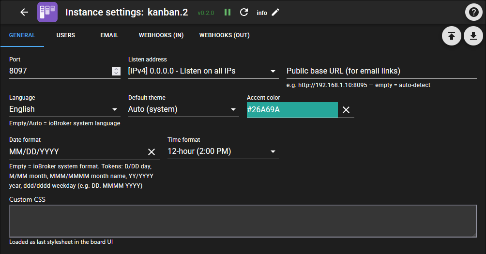
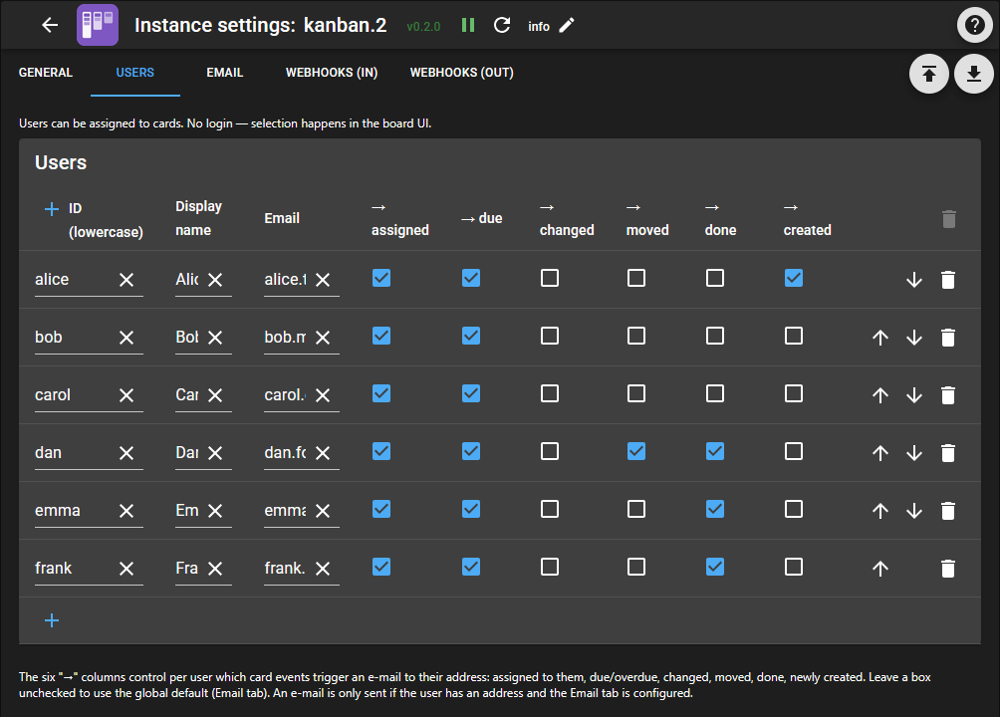
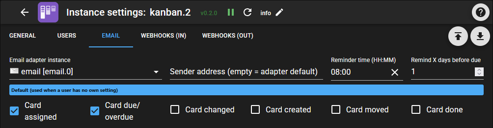
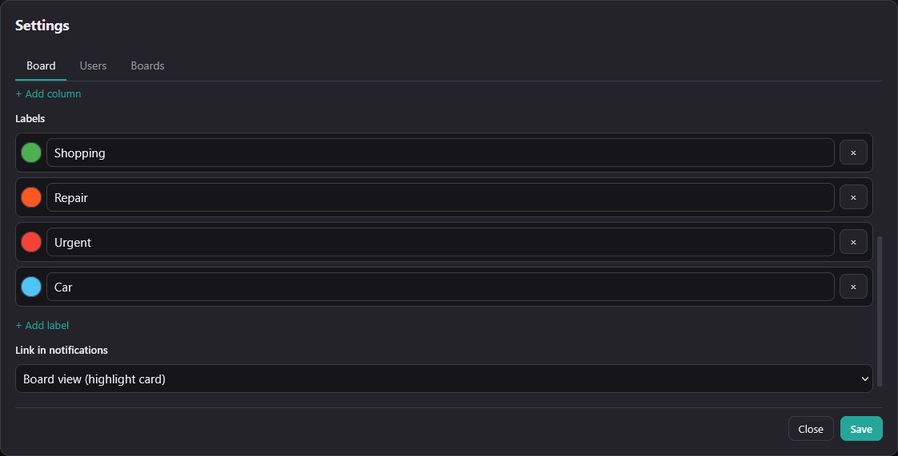
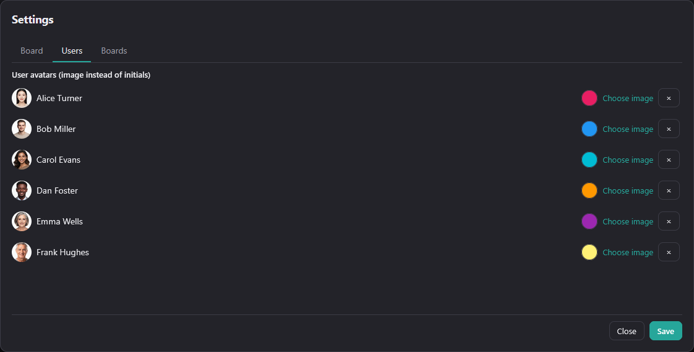
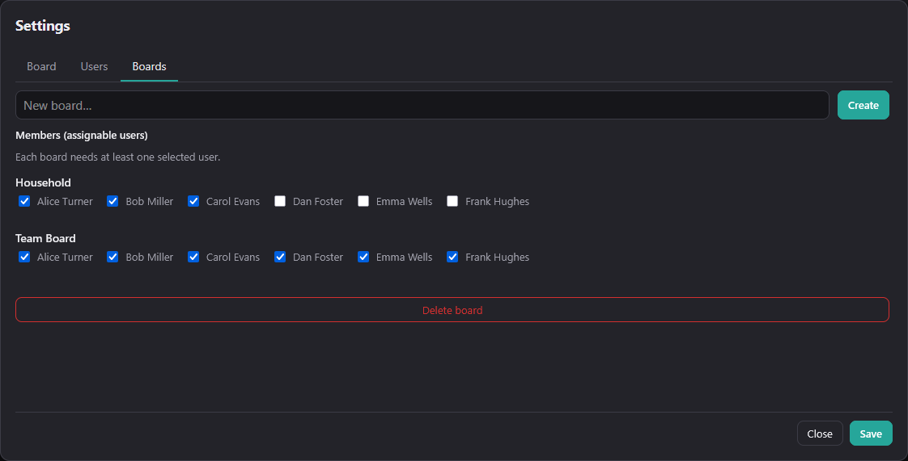
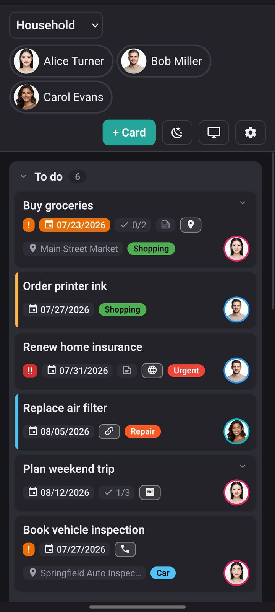
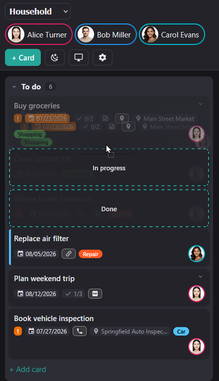

# ioBroker Kanban – Documentation (English)

A full-featured **Kanban board as a dedicated ioBroker adapter**. The adapter ships its own web server, serves a lean single-page app (vanilla JS, no framework) and keeps all open views in sync live via WebSocket. Cards are moved by drag & drop, boards and columns are freely configurable, tasks can recur, notifications go out by e-mail (including calendar invites), and everything can be driven from other automations via REST, webhooks or `sendTo`.

> **Who is it for?** Anyone who wants shared task management in their smart home – family, flat-share, house maintenance – tightly integrated with ioBroker (scripts, Lovelace, Node-RED).

> **Version 0.2.0** – Mobile (accordion columns, full-screen dialogs with a fixed action bar), assignable users per board, header chips as a saved per-board filter, user colours in the web UI (no restart), automatic text contrast colour on labels/avatars, per-board notification link target, per-instance date and time format (moment/Day.js tokens incl. localised month and weekday names), at least one assignee required per card, per-column display limit, Material Design icons throughout.

> **Version 0.1.3** – Fix: the column task count now respects the active person/label filter (previously showed the column total).

> **Version 0.1.2** – "Share view": labels now act as a **blacklist** (selection hides them, new labels stay visible); `doneLimit` distinguishes **empty = all** from **`0` = none**.

> **Version 0.1.1** – security update: write protection for the REST API via token (`X-Kanban-Token`), XSS-sanitized Markdown preview, safe link schemes only, and a Content Security Policy. See [Security & access control](#security--access-control).


---

## Contents

- **[Installation & first steps](#installation--first-steps)**
- **[Part A: Instance settings (ioBroker admin)](#part-a-instance-settings-iobroker-admin)**
  - [Tab "General"](#tab-general)
  - [Tab "Users"](#tab-users)
  - [Tab "Email" – notifications](#tab-email--notifications)
  - [Tab "Webhooks (in)"](#tab-webhooks-in)
  - [Tab "Webhooks (out)"](#tab-webhooks-out)
- **[Part B: The board (web UI)](#part-b-the-board-web-ui)**
  - [Header bar](#header-bar)
  - [Boards, columns & labels](#boards-columns--labels)
  - [Cards – all fields](#cards--all-fields)
  - [Recurrence](#recurrence)
  - [Public holidays](#public-holidays)
  - [Users in the board](#users-in-the-board)
  - [Mobile view](#mobile-view)
  - [Sharing views / URL parameters](#sharing-views--url-parameters)
- **[Part C: Integration & automation](#part-c-integration--automation)**
  - [REST API](#rest-api)
  - [Webhooks – inbound](#webhooks--inbound)
  - [Webhooks – outbound](#webhooks--outbound)
  - [sendTo & action state](#sendto--action-state)
  - [Live sync & deep links](#live-sync--deep-links)
  - [ioBroker states & objects](#iobroker-states--objects)
- **[Part D: Reference](#part-d-reference)**
  - [Security & access control](#security--access-control)
  - [Language / internationalization](#language--internationalization)
  - [FAQ & pitfalls](#faq--pitfalls)

---

## Installation & first steps

1. Install the adapter and create an **instance** (`kanban.0`).
2. In the instance settings, adjust **port** (default `8095`), **IP binding** (default `0.0.0.0`) and **base URL** as needed.
3. Open the web UI: **`http://<host>:8095/`**
4. On first launch there is no board yet. Use the **gear icon (⚙)** at the top right to create one. Every new board comes with three default columns:
   - **To do** (`todo`)
   - **In progress** (`doing`)
   - **Done** (`done`, flagged as the "Done" column)
5. Create your first task with **"+ Card"**.

**Multiple instances:** Every instance (`kanban.0`, `kanban.1`, …) is a fully independent system with its own port, language, users and boards – **no data is shared**. Useful e.g. for separate areas (family vs. club) or a test system next to the production board.

**How this documentation is organised:** [Part A](#part-a-instance-settings-iobroker-admin) covers everything configured in the **ioBroker admin** under *Instances → `kanban.0` → gear* (port, language, user list, e-mail, webhook tokens). [Part B](#part-b-the-board-web-ui) describes the **web UI** of the board itself (boards, columns, cards, views). [Part C](#part-c-integration--automation) is aimed at scripts and third-party systems, [Part D](#part-d-reference) holds security, languages and the FAQ.

---

## Part A: Instance settings (ioBroker admin)

These settings live in the **ioBroker admin** under *Instances → `kanban.0` → gear*. They apply to the **entire instance** and only take effect on **Save** – the adapter restarts in the process. The sections below match the five tabs of the configuration page.

### Tab "General"



| Setting | Meaning |
|---|---|
| **Port** | Web server port (default `8095`). If it is taken, the adapter automatically picks a free one. |
| **IP address** | Bind address (default `0.0.0.0` = all interfaces). |
| **Base URL** | Publicly reachable URL used in e-mail links (e.g. behind a reverse proxy). Empty = auto-detect local IP. |
| **Default theme** | `auto` (system), `light` or `dark`. |
| **Accent color** | Color of the controls (default `#7E57C2`). |
| **Language** | UI language (`de`, `en`, `fr`, `nl`, `it`). Empty/automatic = ioBroker system language. Can be overridden per URL with `?lang=xx`. |
| **Date format** | Display format of the due date. **Empty = ioBroker system format.** Tokens see the table below (default `DD.MM.`). |
| **Time format** | `24 hours (14:00)` or `12 hours (2:00 PM)`. Applies to the optional time of day on cards. |
| **Custom CSS** | Served as `/api/custom.css` – for individual tweaks. |

#### Date format tokens

The common moment/Day.js notation applies (case-sensitive):

| Token | Meaning | Example (20 July 2026) |
|---|---|---|
| `D` / `DD` | day without / with leading zero | `20` / `20` |
| `M` / `MM` | month as a number without / with leading zero | `7` / `07` |
| `MMM` / `MMMM` | month name short / full | `Jul` / `July` |
| `YY` / `YYYY` | year two / four digits | `26` / `2026` |
| `ddd` / `dddd` | weekday short / full | `Mon` / `Monday` |

Month and weekday names are rendered in the board language. Examples: `DD.MM.` → `20.07.` · `DD MMMM YYYY` → `20 July 2026` · `dddd, DD MMM` → `Monday, 20 Jul` · `MM/DD/YYYY` → `07/20/2026`.

> Note: ioBroker itself uses `OO`/`O` for month names. Those are **not** supported here – a string copied from the system format that contains `OO` has to be rewritten to `MMMM`.

### Tab "Users"

This is where you define **which people exist** – the list applies to the entire instance. In the board they appear as chips in the header bar and can be assigned to cards.



| Field | Meaning |
|---|---|
| **name** | Internal ID, lowercase, no special characters (e.g. `bjoern`). Used in URL parameters and assignments. |
| **displayName** | Display name (e.g. `Björn`). |
| **email** | Optional. Target address for e-mail notifications. |
| **notify…** | Six per-user checkboxes controlling notifications – see [Tab "Email" – notifications](#tab-email--notifications). |

> **Not here:** user colour, avatar image and the assignment to individual boards are maintained directly in the web UI since 0.2.0 – see [Users in the board](#users-in-the-board).

### Tab "Email" – notifications

Notifications are triggered on card events and delivered via **e-mail** (through the ioBroker `email` adapter) and/or **outbound webhooks**. In addition, every event is written to the state `kanban.0.lastEvent` (as a script trigger).



| Setting | Meaning |
|---|---|
| **Email adapter instance** | Which `email.x` instance is used for sending. |
| **Sender** | Optional sender address (empty = email adapter default). |
| **Reminder time** | `HH:MM` – when due cards are checked (default `08:00`). |
| **Remind X days before due** | Lead time for `cardDue` reminders. |
| **Default** | Global fallback switches per event – they apply when a user has nothing set of their own (see below). |

#### Who gets notified, and when?

In the **"Users"** tab every user has six checkboxes – they decide which events trigger an e-mail for that person:

| Checkbox | When exactly it fires | Recipients |
|---|---|---|
| **assigned** (`notifyAssigned`) | As soon as someone is **added** as an assignee – on card creation for every initial entry, and when added later. Fires **once per person**. | **Only the person concerned** |
| **due** (`notifyDue`) | Daily at the reminder time (default `08:00`) for cards due today or within the lead days. A run missed due to an adapter restart is caught up. | All assignees of the card |
| **changed** (`notifyUpdated`) | On every edit of a card (title, date, labels, checklist …). | All assignees of the card |
| **moved** (`notifyMoved`) | When moved to a **different** column. | All assignees of the card |
| **done** (`notifyDone`) | **In addition** to "moved", if the target column is flagged as *done*. | All assignees of the card |
| **created** (`notifyCreated`) | **Once** when a card is created; likewise when a recurrence spawns the next card. | All assignees of the card |

The core difference between **assigned** and **created**: "assigned" is the **personal** message ("*you* are up now") and goes to that one person only. "created" is the **status message** to all assignees of the card.

**Careful – events overlap.** Some actions trigger several events at once. Anyone with both checkboxes set will receive **several e-mails** – there is no bundling:

| Action | Events fired |
|---|---|
| Create a card **with** assignees | **created** + **assigned** |
| Edit a card and add someone | **changed** + **assigned** |
| Drag a card into the done column | **moved** + **done** |

For most setups **"assigned" alone** is therefore enough. "created" pays off if you also want to hear about cards that *others* create and where you are a co-assignee.

**Fallback:** if a user has nothing set for an event, the **global default** applies (tab "Email", section "Default"). This way existing users keep receiving notifications without having to configure everything individually.

**No self-spam:** whoever triggers a change is not notified about that very change.

**Prerequisite:** only users **with an e-mail address on file** receive mails; everyone else is skipped.

> **Deleted cards** trigger **no** e-mail – there is deliberately no checkbox for them. The `cardDeleted` event only shows up in the `lastEvent` state and in outbound webhooks.

#### Calendar invite (.ics)

If **"Calendar invite"** is enabled on a card and a date is set, the adapter attaches a `termin.ics` to the notification e-mail:

- **Without time** → all-day event on the due date.
- **With time** → timed event of one hour duration.
- Title (`SUMMARY`), description, **location** (`LOCATION`) and link (`URL`) are carried over.
- **Time zone:** timed events are emitted unambiguously in UTC; the underlying time zone is determined from the system (or `system.config`) – including daylight saving. All-day events are deliberately time-zone-free.

The attachment is included with **every** notification for the card – so if you enable the invite only later, it arrives with the next "Card changed" mail.

### Tab "Webhooks (in)"

Other systems (or ioBroker itself) can modify cards and boards via HTTP. Those requests are secured with **tokens**, which are managed here. The matching endpoints and commands are documented in [Part C](#webhooks--inbound).

| Field | Meaning |
|---|---|
| **name** | Label (shown as the source in logs). |
| **token** | Secret token, part of the URL. |
| **allowedBoards** | `*` = all boards, or a list of allowed board IDs (separated by space/comma). |
| **enabled** | Token active/inactive. |

The **"Generate new token"** button (above the table) automatically adds a new row with a secure random token (32 hex chars) and the name `agent`/`agent1`/…. Then adjust the name, optionally restrict `allowedBoards`, and **Save**. Alternatively fill the token field manually (e.g. `openssl rand -hex 16`). **Recommendation:** use a separate token for each integration (each agent, each script) — that way each one can be revoked or replaced individually via the `enabled` checkbox.

Invalid token → HTTP `401`. Board not allowed → HTTP `403`.

### Tab "Webhooks (out)"

The adapter can send an **HTTP POST** to arbitrary URLs on every event – e.g. to Node-RED, IFTTT, a chat service or your own scripts.

| Field | Meaning |
|---|---|
| **name** | Label. |
| **url** | Target URL (receives `POST` with a JSON body). |
| **events** | `*` = all events, or a list of event types (separated by comma/semicolon/space). |
| **enabled** | Active/inactive. |

**Event types:** `cardCreated`, `cardUpdated`, `cardMoved`, `cardAssigned`, `cardDone`, `cardDeleted`, `cardDue`.

The structure of the JSON payload and the delivery details are in [Part C](#webhooks--outbound).

---

## Part B: The board (web UI)

The web UI at **`http://<host>:8095/`** is the actual workspace. Everything in this part is configured **directly in the browser** and takes effect immediately – no adapter restart. Thanks to live sync, changes show up on all open devices right away.

### Header bar

The **header bar** contains, left to right: the **board selector**, the **user chips** (doubling as a person filter, see [Users in the board](#users-in-the-board)), the **"+ Card"** button, the **theme toggle** (sun/moon), the **"Views"** dialog (monitor icon, see [Sharing views](#sharing-views--url-parameters)) and the **settings** (gear).

The gear opens the **board manager**, which covers the sections below. In embed mode (`embed=1`) the header bar is hidden entirely.

### Boards, columns & labels

The **gear (⚙)** opens the board manager with three tabs: **Board** (title, columns, labels and the link target of the current board), **Users** (colours and avatars, see [Users in the board](#users-in-the-board)) and **Boards** (create/delete boards and assign members). Changes are only applied on **Save**.

#### Columns

Columns can be created, reordered by drag & drop, renamed and deleted. **Deleting a column does not lose any cards** – they are moved to the first column of the board automatically.


Above the column list sits a header row with the field names (**Title · Max · WIP · New · Done**). Every heading carries a tooltip with the full explanation.

- **Display limit (Max):** a number > 0 shows only the first N cards in that column; below them a discreet `+X more` hint appears. `0` = show all. Useful so a long backlog does not blow up the board. The counter in the column header still counts **all** cards of the column.
- **WIP limit** (work in progress): a number > 0 caps the recommended card count. If exceeded, the column warns visually (counter & header are highlighted). `0` = no limit. The limit is a **warning**, not a hard block. It always refers to the **total** number of cards in the column – even while a person/label filter is showing fewer.
- **"New"** (`allowAdd`): controls in which columns the "+ Add card" link appears.
- **"Done" column** (`isDone`): cards moved here count as completed (`doneAt` is set, recurrences are triggered).
- **Show/hide done (eye icon):** every done column has an eye toggle at the top right that shows or hides the completed cards (stored per device).
- **Limit of visible done cards:** the URL parameter `doneLimit=N` (see [Sharing views / URL parameters](#sharing-views--url-parameters)) shows only the N most recently completed cards – handy for compact, shared views.

#### Labels

Labels are coloured tags and are managed **per board** in the *Board* tab (create, rename, recolour, delete). On a card they appear as a coloured badge with automatically contrasting text; in the [Views dialog](#sharing-views--url-parameters) they can be used as a blacklist to hide cards.

#### Link in notifications (from 0.2.0)



Per board you can choose where the "open card" link in notification e-mails points: **board view** (default – opens the board and briefly highlights the card), **card editor** (opens the edit dialog directly) or **custom URL** (a fixed address, e.g. your Lovelace dashboard the board is embedded in).

### Cards – all fields

**Clicking a card** opens the editor. A card has the following content fields (settable via the API under the same names):


| Field | Type | Description |
|---|---|---|
| **title** | text | Task title (required). |
| **description** | Markdown | Description, rendered as Markdown (links, images, lists …). Embedded HTML is sanitized before display (XSS protection). |
| **due** | `YYYY-MM-DD` | Due date. Overdue / soon-due cards are highlighted. |
| **dueTime** | `HH:MM` | Optional time of day. Enabled via a checkbox, shown on the card after the date. Only effective together with `due`. |
| **priority** | `0`/`1`/`2` | Normal / High / Urgent. |
| **assignees** | list of user IDs | Assignees. Determine who receives notifications. **Required:** the UI needs at least one assignee before a card can be saved. Required fields are marked with a red `*`. Cards created via API/webhook may stay unassigned. |
| **labels** | list of label IDs | Colored tags. Labels are managed per board (create, rename, recolor, delete). |
| **color** | hex color | Colored bar on the left edge of the card. Chosen via an embedded color picker (color field + hue slider + hex input) or presets. |
| **link** | URL | A link. The card shows a **type-dependent icon** – see [Link types](#link-types). |
| **location** | text | Location. Shown as a location badge (pin icon) on the card and copied into the calendar invite as `LOCATION`. |
| **checklist** | list | Sub-items with checkboxes; shown as progress `✓ 2/5` on the card. The **chevron (▾/▴)** at the top right expands/collapses the items directly on the card, where they can also be **ticked off** (saved immediately). |
| **calendarInvite** | yes/no | If enabled **and** a due date is set, a **`.ics` calendar invite** is attached to every notification e-mail for this card. |
| **recurrence** | object | Recurrence rule – see [Recurrence](#recurrence). |

The adapter also manages automatically: `id`, `columnId`, `order`, `createdAt`, `createdBy`, `movedAt`, `doneAt`.

#### Link types

The board derives a matching icon (Material Design Icons) from the address you enter. Rules are evaluated top to bottom – the **first match wins**.

| Icon | Detected by | Example |
|:--:|---|---|
|  | `mailto:` | `mailto:hausmeister@example.com` |
|  | `tel:` | `tel:+491701234567` |
|  | `youtube.com` / `youtu.be` | `https://youtu.be/xxxxxxxxxxx` |
|  | address ends in `.pdf` | `https://example.com/anleitung.pdf` |
|  | `.jpg` `.jpeg` `.png` `.gif` `.webp` `.svg` | `https://example.com/grundriss.png` |
|  | route: `waze.com`, `/maps/dir/`, `daddr=` | `https://www.waze.com/ul?ll=52.52,13.405` |
|  | place: Google/Apple Maps, OpenStreetMap, `geo:` | `geo:52.52,13.405` |
|  | internal address: private ranges (`10.`, `172.16.`–`172.31.`, `192.168.`), `127.`, `169.254.`, `localhost` plus host names ending in `.local` `.lan` `.home` `.internal` `.fritz.box` | `http://192.168.1.10:8123/` |
|  | everything else | `https://example.com` |

Only the safe schemes `http(s)`, `mailto:`, `tel:` and `geo:` are clickable – see [Security & access control](#security--access-control).

### Recurrence

Recurring tasks work **on completion** (the Kanban way): as soon as a recurring card is moved to the "Done" column, a **fresh card** with the next matching due date is created automatically in the first non-done column (checklist items reset). Cards with recurrence carry a recurrence badge (circular-arrows icon).

If a recurring card is created **without** a manual date, the adapter automatically sets the next matching date.

| Type (`recurrence.type`) | Meaning | Additional fields |
|---|---|---|
| `daily` | Every day | – |
| `weekly` | On specific weekdays | `dayOfWeek`: list `[1..7]` (1 = Monday … 7 = Sunday) |
| `monthly` | Fixed day of month | `dayOfMonth`: `1..31` (the 31st is clamped to the last day in short months) |
| `monthly_weekday` | N-th/last weekday of the month, e.g. **2nd Tuesday** | `ordinal`: `1..4` or `-1` (last), `dayOfWeek`: `[iso]` |
| `workday` | First/last/n-th **working day** of the month | `workdayPos`: `first` / `last` / `nth` / `nth_last`, `n`: for `nth`/`nth_last` |
| `yearly` | Yearly | `month`: `1..12`, `dayOfMonth`: `1..31` |
| `every_n_days` | Every X days from a start date | `interval`: N, `startDate`: `YYYY-MM-DD` |

A **working day** means: not a weekend **and** not a public holiday (see below). Example: "first working day in May" lands on the 4th if May 1st is a holiday/weekend.

### Public holidays

For the **working-day recurrences** the adapter computes public holidays itself (Easter formula + fixed dates + the German "Buß- und Bettag"), so even dates far in the future are calculated correctly.

- If the ioBroker **`feiertage`** adapter is installed, the Kanban adapter adopts its **state/region configuration** (which holidays apply). Only genuinely work-free public holidays count – decorative days (e.g. Valentine's Day) are ignored.
- Without the `feiertage` adapter a **fallback** with the nationwide public holidays is used.

> Changes to the `feiertage` adapter are picked up on the next start of `kanban.0`.

### Users in the board

Which people exist at all comes from the instance settings ([Tab "Users"](#tab-users)). Their appearance and board assignment, however, are maintained directly in the web UI – without restarting the adapter.

**Header chips as a filter:** The user chips in the header double as a **multi-select filter** – tapping toggles a person on or off. With a partial selection the board only shows cards of the selected people; with **all or none** active, all cards are shown. The selection is **stored per board in the browser** and restored on the next visit.

**User colour:** The colour of the avatar ring and chip is maintained **in the board UI** since 0.2.0 (⚙ → Users) and applies immediately, without restarting the instance.

**Avatar image (optional):** By default the avatar shows the initials (on the user color). In the board UI under **⚙ → "User avatars"** you can **upload a PNG/JPG** per user, which is then shown as a round avatar (with preview; the image is automatically cropped to a square, scaled to 128 px and stored in the ioBroker file storage – no config bloat). "Remove avatar" reverts to the initials.



**Members per board:** Under **⚙ → Boards** you define per board which users are assignable there (card dialog, header chips and the Views dialog only show members). Every board needs **at least one member**; new boards start with all users.



### Mobile view

On narrow screens the board stacks the columns vertically; each column collapses as an accordion (state is remembered per device). The card, board and views dialogs open full-screen with a fixed action bar at the bottom. To move a card, press and hold briefly – while dragging, a quick-move menu with the target columns appears.

 

*Left: columns stacked as an accordion. Right: the quick-move menu that appears over the target columns while dragging a card.*

### Sharing views / URL parameters

The **monitor icon** in the header opens the **"Views"** dialog. There you assemble a filtered view (board, users (multiple), labels (multiple), visible columns, done-card limit, controls to hide) and get a **ready-to-copy URL** below. Ideal for embedding in Lovelace (webpage card) or for sharing.


All parameters can also be appended to the URL directly:

| Parameter | Effect |
|---|---|
| `board=<id>` | Opens this board. |
| `users=<name,name>` | **Person filter**: shows only cards assigned to at least one of these users (sets the header chips accordingly). `user=<name>` is the short form for a single user. |
| `label=<id,id>` | **Label blacklist** (multiple possible): hides cards that have one of these labels – new labels stay visible automatically. |
| `columns=<id,id>` | Shows only these columns. Others are hidden. |
| `doneLimit=N` | In done columns, show only the N most recently completed cards (`0` = none, omit = all). |
| `hideSettings=1` | Hides the settings gear. |
| `embed=1` | **Embed mode**: hides the whole header bar (for iframe/Lovelace). |
| `theme=auto\|light\|dark` | Forces a theme. |
| `accent=%23RRGGBB` | Accent color (hex, encode `#` as `%23`). |
| `card=<id>` | Opens a card directly (deep link, e.g. from e-mails). |

**Examples**

```
# Compact embed: only board "familie", no header
http://192.168.1.10:8095/?board=familie&embed=1&theme=auto

# Only "In progress" + last 3 done cards, filtered to two people
http://192.168.1.10:8095/?board=familie&columns=doing,done&doneLimit=3&users=bjoern,heike

# Everything except cards with label "private", settings hidden
http://192.168.1.10:8095/?board=familie&label=private&hideSettings=1
```

> **Lovelace/iframe:** the adapter sets **no** frame headers (`X-Frame-Options`/`frame-ancestors`). The CSP added in 0.1.1 is a `<meta>` tag and does **not** restrict embedding – so the UI can still be embedded directly in a Lovelace webpage card or an `<iframe>`.

---

## Part C: Integration & automation

Boards and cards can be driven entirely from the outside – from ioBroker scripts, Node-RED, shell scripts or LLM agents.

### REST API

For integrations on the same network there is a REST API (the same one the web UI uses). **Reading** (`GET`) is open, **writing** (`POST`/`PATCH`/`DELETE`) requires a token from 0.1.1 – see [Security & access control](#security--access-control).

| Method & path | Purpose |
|---|---|
| `GET /api/config` | UI configuration (users, theme, accent color). |
| `GET /api/users` | User list. |
| `GET /api/custom.css` | The custom CSS configured in the settings. |
| `GET /avatars/<name>` | A user's avatar image (PNG). |
| `POST /api/users/<name>/avatar` | Set avatar (`{ image: "data:image/png;base64,…" }`, max 512 KB; token required). |
| `DELETE /api/users/<name>/avatar` | Remove avatar (token required). |
| `GET /api/boards` | All boards (short form). |
| `POST /api/boards` | Create a board (`{ id?, title }`). |
| `GET /api/boards/<id>` | Board with all cards. With `?rev=<n>` it returns `{unchanged:true}` if unchanged (polling). |
| `PATCH /api/boards/<id>` | Change a board (title, columns, labels). |
| `DELETE /api/boards/<id>` | Delete a board. |
| `POST /api/boards/<id>/cards` | Create a card. |
| `PATCH /api/boards/<id>/cards/<cardId>` | Change a card. |
| `POST /api/boards/<id>/cards/<cardId>/move` | Move a card (`{ columnId, order }`). |
| `DELETE /api/boards/<id>/cards/<cardId>` | Delete a card. |

> **Write access** to `/api` requires a token from 0.1.1 (`X-Kanban-Token`; the web UI sends it automatically), **reading** stays open on the LAN. Details and limits: [Security & access control](#security--access-control). For external access use the token-based [webhooks](#webhooks--inbound).

### Webhooks – inbound

The **tokens** used here are managed in the instance settings ([Tab "Webhooks (in)"](#tab-webhooks-in)).

#### Generic endpoint (recommended)

```
POST /webhook/<token>/action
Content-Type: application/json
```

The body contains `cmd` plus the appropriate fields. The same **command vocabulary** applies as for `sendTo` and the `action` state:

| `cmd` | Required fields | Additional fields |
|---|---|---|
| `addBoard` | `title` | `id` (optional, otherwise derived from the title) |
| `deleteBoard` | `board` | – |
| `addCard` | `board`, `title` | all card fields (`due`, `assignees`, `labels`, `priority`, `location`, `recurrence`, …), `columnId` |
| `updateCard` (alias `editCard`) | `board`, `cardId`\|`id` | card fields to change |
| `moveCard` | `board`, `cardId`\|`id`, `column`\|`columnId` | `order` |
| `doneCard` | `board`, `cardId`\|`id` | – (moves to the done column) |
| `deleteCard` | `board`, `cardId`\|`id` | – |
| `listBoards` / `getBoards` | – | – |
| `getBoard` | `board` | – |

> **Field-name pitfalls (important!)**
> - The card ID is **`cardId` OR `id`** – **not** `card`.
> - The target column of `moveCard` is **`column` OR `columnId`**.
> - The board is given via **`board` OR `boardId`**.

**Examples**

```bash
TOKEN=your_token
BASE=http://192.168.1.10:8095

# Create a card
curl -X POST "$BASE/webhook/$TOKEN/action" -H 'Content-Type: application/json' -d '{
  "cmd": "addCard",
  "board": "familie",
  "columnId": "todo",
  "title": "Take out the bins",
  "due": "2026-07-20",
  "assignees": ["bjoern"],
  "labels": ["household"],
  "priority": 1
}'

# Move a card to another column
curl -X POST "$BASE/webhook/$TOKEN/action" -H 'Content-Type: application/json' -d '{
  "cmd": "moveCard", "board": "familie", "cardId": "c_abc123", "column": "doing"
}'

# Mark a card as done
curl -X POST "$BASE/webhook/$TOKEN/action" -H 'Content-Type: application/json' -d '{
  "cmd": "doneCard", "board": "familie", "id": "c_abc123"
}'

# Update a card (e.g. enable the calendar invite afterwards)
curl -X POST "$BASE/webhook/$TOKEN/action" -H 'Content-Type: application/json' -d '{
  "cmd": "updateCard", "board": "familie", "id": "c_abc123",
  "calendarInvite": true, "location": "Town hall"
}'

# Delete a card
curl -X POST "$BASE/webhook/$TOKEN/action" -H 'Content-Type: application/json' -d '{
  "cmd": "deleteCard", "board": "familie", "id": "c_abc123"
}'
```

#### Resource endpoints (alternative)

The same actions are also available as REST-like webhook routes (token in the URL):

```
POST   /webhook/<token>/boards/<id>/cards
PATCH  /webhook/<token>/boards/<id>/cards/<cardId>
POST   /webhook/<token>/boards/<id>/cards/<cardId>
POST   /webhook/<token>/boards/<id>/cards/<cardId>/move
```

### Webhooks – outbound

Target URLs and event filters are configured in the instance settings ([Tab "Webhooks (out)"](#tab-webhooks-out)).

**Delivery:** HTTP POST with `Content-Type: application/json`, 5-second timeout, **one** automatic retry after 2 seconds.

**Example payload** (body of the outbound POST):

```json
{
  "event": "cardMoved",
  "ts": "2026-07-12T14:05:46.415Z",
  "board": { "id": "familie", "title": "Family" },
  "card": {
    "id": "c_abc123",
    "title": "Take out the bins",
    "columnId": "doing",
    "due": "2026-07-20",
    "assignees": ["bjoern"],
    "labels": ["household"],
    "priority": 1
  },
  "detail": { "fromColumn": "todo", "toColumn": "doing", "by": "bjoern" }
}
```

Every event has the shape `{ event, ts, board:{id,title}, card:{…}, detail:{…} }`. The `detail` field varies by event type (e.g. `assignee` for `cardAssigned`, `fromColumn`/`toColumn` for `cardMoved`).

### sendTo & action state

The same command vocabulary (`addCard`, `moveCard`, …) is reachable in several ways:

**`sendTo` (from ioBroker scripts):**

```javascript
sendTo('kanban.0', 'addCard', {
    board: 'familie',
    title: 'Created from a script',
    due: '2026-07-20',
    assignees: ['bjoern']
}, (res) => log(JSON.stringify(res)));
```

**`action` state:** write a JSON command to the state `kanban.0.action` (without `ack`):

```javascript
setState('kanban.0.action', JSON.stringify({
    cmd: 'moveCard', board: 'familie', cardId: 'c_abc123', column: 'done'
}));
```

The adapter executes the command and clears the state again.

### Live sync & deep links

- **WebSocket `/ws`:** on every change the server sends a `dirty` message to all open views, which reload the affected board. All devices see changes almost instantly.
- **Polling fallback:** if the WebSocket is unavailable, the UI periodically checks for changes using `?rev=`.
- **Deep link:** `…/?board=<id>&card=<id>` opens the given card directly – this is how notification e-mails link ("Open card in board").

### ioBroker states & objects

Besides the UI, the adapter creates states you can use in scripts, VIS/Lovelace or Node-RED:

| State | Type | Meaning |
|---|---|---|
| `kanban.0.info.connection` | bool | Web server running. |
| `kanban.0.lastEvent` | json | Last triggered event (`{event, ts, board, card, detail}`) – ideal as a script trigger. |
| `kanban.0.action` | json (writable) | Command input, see [sendTo & action state](#sendto--action-state). |
| `kanban.0.info.apiSecret` | string | Internal REST-API write token (from 0.1.1). |
| `kanban.0.boards.<id>.data` | json | Full board (cards, columns, labels). |
| `kanban.0.boards.<id>.rev` | number | Revision (increments on every change – for polling). |
| `kanban.0.boards.<id>.cardCount` | number | Number of cards in the board. |
| `kanban.0.boards.<id>.overdueCount` | number | Overdue cards in the board. |
| `kanban.0.users.<name>.assignedCount` | number | Open cards assigned to this person. |
| `kanban.0.users.<name>.overdueCount` | number | Of those, overdue. |
| `kanban.0.users.<name>.overdueList` | json | List of overdue cards (title + board/column). |

The `boards.*` and `users.*` mirror states are handy for dashboards ("Björn: 3 open, 1 overdue") or automations without querying the REST API.

---

## Part D: Reference

### Security & access control

> **New in 0.1.1** – added after a security review.

**Write protection for the REST API (token).** Read access (`GET`) to `/api` stays open on the LAN (the web UI and simple dashboards need no token). **Write** access (`POST`/`PATCH`/`DELETE`) requires a token in the `X-Kanban-Token` header. Valid tokens are:

- the automatically generated **SPA secret** (state `kanban.0.info.apiSecret`), which the server hands to its own UI as `<meta name="kanban-token">` – the web UI sends it transparently, nothing to configure;
- any active **inboundToken** (tab "Webhooks (in)"), so scripts/agents can also write via `/api`.

Without a valid token → HTTP `401`. The native setting `apiWriteProtection: false` disables the protection (then `/api` behaves as in 0.1.0).

> **Honest limit of this protection:** because the UI works **without a login**, any device on the same network that loads the page can read the SPA secret. The token thus reliably blocks **third-party websites/CSRF** and naive scanners, but is **not** a substitute for network isolation. For hard isolation, bind the port to the LAN/`127.0.0.1` only and put an authenticating reverse proxy in front.

**Sanitized description preview.** The Markdown description is cleaned with an HTML sanitizer (DOMPurify) before display – embedded `<script>`, `onerror` etc. is removed (protection against stored XSS).

**Safe link schemes only.** A card's link badge is clickable only for `http(s)`, `mailto:`, `tel:` and `geo:`; other schemes (e.g. `javascript:`) are not executed as a link.

**Content Security Policy.** The UI sets a CSP (as `<meta>`) that blocks third-party/inline scripts. It **deliberately omits** `frame-ancestors` so the iframe/Lovelace embedding stays free.

### Language / internationalization

The interface is **multilingual**. The default language follows the **system language configured in ioBroker**; the language can optionally be fixed in the instance settings.

Translations live as **one file per language** under `www/i18n/` (e.g. `de.json`, `en.json`). Currently **five languages** are included: **German, English, French, Dutch and Italian** (selectable in the instance "Language" dropdown: Auto/de/en/fr/nl/it). Further languages can be added simply by dropping in another JSON file with the same keys. If no file exists for the requested language, English is used as fallback.

### FAQ & pitfalls

- **No e-mails arrive.** Delivery depends entirely on the configured `email` adapter. Check the credentials there (modern mailboxes often require OAuth2 instead of a password). The Kanban adapter only hands over the message.
- **The `.ics` is not attached.** The attachment is only created if **"Calendar invite"** is enabled on the card **and** a **due date** is set.
- **Time without a date disappears.** A time is always tied to a due date – without a date it is discarded.
- **Color selection.** The adapter deliberately uses an **embedded** color picker (not the native system dialog), so the full color space including hex input is available on every device, mobile included.
- **Custom design (theming).** Via **instance settings → General → "Custom CSS"** you can restyle the UI. It is based on CSS variables you can override – e.g. for a black-and-orange look (inspired by Lovelace):

  ```css
  :root, html[data-theme="dark"] {
    --bg: #000000;                  /* page background */
    --surface: #161616;             /* cards & dialogs */
    --surface2: rgba(10,10,10,.55); /* column background */
    --text: #f5f5f5;
    --border: rgba(255,152,0,.3);   /* borders (everywhere) */
    --accent: #ff9800 !important;   /* accent color */
  }
  .column { border: 1px solid var(--border); }
  ```

  Key variables: `--bg`, `--surface`, `--surface2`, `--text`, `--muted`, `--border`, `--accent`, `--danger`, `--warn`, `--radius`. The `!important` on `--accent` is required because the accent color is also set via the config field.
- **"Close" in the settings dialog discards changes.** The board manager only applies changes on **Save**; "Close" discards them without asking.
- **The date in the edit dialog looks different from the card.** The input is the browser's native date field and follows the browser language; the display on the cards follows the instance's configured **date format**. Both mean the same date.
- **A webhook command fails with "card 'undefined' does not exist".** Almost always the wrong ID field: it is `cardId` or `id`, **not** `card`.
- **New columns missing in a shared URL.** The `columns=` filter is static. If a column is added later, the view must be shared again. In the "Views" dialog itself, columns are detected live.
